# Fabric - Trabajando con Notebooks en PySpark

En este post estaremos explorando algunas de las características del Lakehouse de Fabric, crearemos un pipeline de data factory para automatizar el copiado de un archivo CSV y trabajaremos ese archivo en un notebook con PySpark. Utilizaremos un sample con un ejercicio sencillo.

Consideraciones: 
-Se debe contar con una suscripción de Fabric y acceso al workspace. 
-Se debe contar con un Lakehouse y workspace de Data engineering configurado. 
-Se omite creación de Lakehouse y pipeline de Data Factory. 

 
-Comenzamos:  

Nos logueamos con nuestro usuario en https://app.powerbi.com/

Una vez que se inició sesión, en el margen inferior izquierdo de productos se selecciona la opción "Data Engineering"

Esta opción nos permite conectarnos al espacio de ingeniería de datos integrado a Fabric.

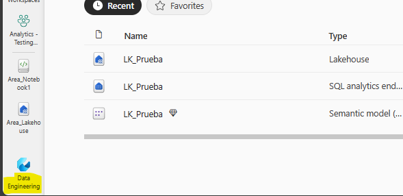

Ahí buscaremos nuestro Lakehouse nombrado "Lk_Prueba"

Qué es el Lakehouse de Fabric? 

Microsoft Fabric Lakehouse es una plataforma de arquitectura de datos para almacenar, administrar y analizar datos estructurados y no estructurados en una única ubicación. Es una solución flexible y escalable que permite a las organizaciones manejar grandes volúmenes de datos utilizando diversas herramientas y marcos para procesar y analizar esos datos. Combina la tecnología de Data Lake y Data Warehouse.

Nos ubicamos sobre el Lakehouse de prueba en cuestión y veremos dos carpetas una llamada "Tables" que pertenece a las tablas de SQL y otra llamada "Files" por dónde se pueden cargar files de manera manual. 
En este caso utilizaremos Data factory para ingestar un Sample en la carpeta Files pero de manera automatizada.

Switcheamos de ambiente de trabajo a Data factory, creamos una pipeline con la actividad "Copy data" dónde especificaremos la fuente de dónde se copiará el file.

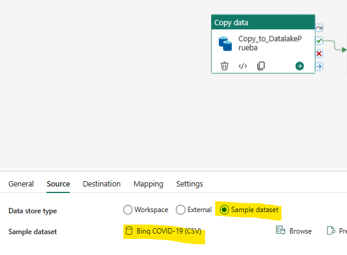

En source elegimos un sample llamado "Bing COVID-19" en formato CSV.

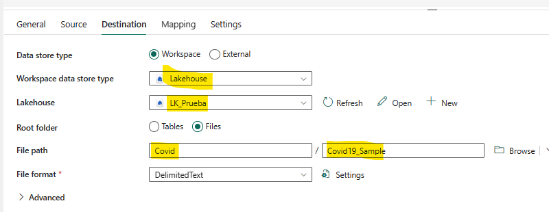

En destination, elegimos nuestro Lakehouse de prueba y configuramos el file path, en este caso de manera manual (se puede parametrizar de manera dinámica)

-  Ejecutamos nuestra pipeline de copy data y volvemos al Lakehouse

Aqui vemos la carpeta y dentro su file. La cuestión es.... Cómo podemos transformar este archivo? La respuesta es: **Con un notebook.**

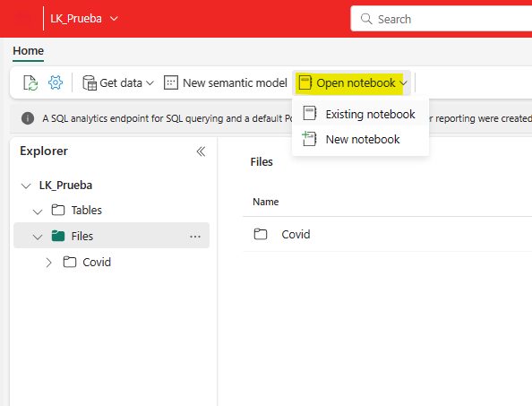

Entonces, abrimos un nuevo notebook y comenzamos a configurar nuestras variables para tomar nuestro archivo CSV.

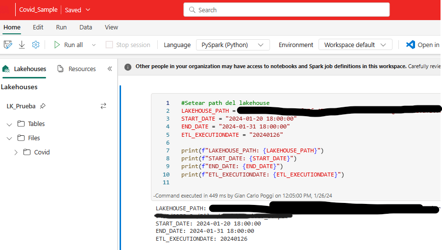

~~~
#Setear path del lakehouse
LAKEHOUSE_PATH = "su ruta"
START_DATE = "2024-01-20 18:00:00"
END_DATE = "2024-01-31 18:00:00"
ETL_EXECUTIONDATE = "20240126"

print(f"LAKEHOUSE_PATH: {LAKEHOUSE_PATH}")
print(f"START_DATE: {START_DATE}")
print(f"END_DATE: {END_DATE}")
print(f"ETL_EXECUTIONDATE: {ETL_EXECUTIONDATE}")
~~~

En este Script declaramos nuestra ruta del lakehouse.

Cómo obtener el Lakehouse path? Sencillo! Se debe hacer clic derecho sobre la carpeta que contiene el archivo y se debe seleccionar la opción "Copy ABFS path"

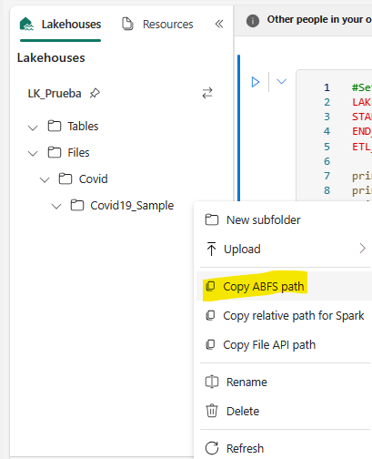

Pasamos a una siguiente linea de comando donde seguimos configurando nuestras variables iniciales, definimos rutas de archivos , extraemos la tabla e imprimimos sus resultados

~~~
#Seteo de variables iniciales
DestinationPath = LAKEHOUSE_PATH 
InitDate = START_DATE
EndDate = END_DATE
ETL_ExecutionDate = ETL_EXECUTIONDATE
fileDestinationPath=DestinationPath

LenExecutionDate = len(ETL_ExecutionDate)+1
MainPath = 'Covid/Covid_Sample'
ChildPath = '/Covid'
lenmainpath = len(MainPath)+LenExecutionDate
lendestination = len(DestinationPath)
getparentlen = lendestination - lenmainpath
ParentPath = DestinationPath[:getparentlen]

LenPath = len(DestinationPath)
LastPosition =  DestinationPath[::-1].find('/')
LenName = LenPath-LastPosition
TableName = DestinationPath[-LastPosition:][:-LenExecutionDate]

print(DestinationPath)
print(TableName) #when running from factory, confirm what is the table name
print(ParentPath)
~~~

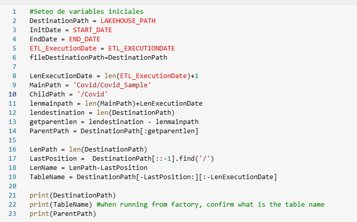

Luego, definimos el schema que tendrá nuestra tabla con sus columnas y procederemos a leer el archivo CSV del COVID, luego imprimimos los resultados del dataframe.

~~~

from pyspark.sql.functions import *
from pyspark.sql.functions import col
from pyspark.sql.types import *

# Definir el esquema del DataFrame
schema = StructType([
    StructField("id", IntegerType(), True),
    StructField("updated", DateType(), True),
    StructField("confirmed", IntegerType(), True),
    StructField("confirmed_change", IntegerType(), True),
    StructField("deaths", IntegerType(), True),
    StructField("deaths_change", IntegerType(), True),
    StructField("recovered", IntegerType(), True),
    StructField("recovered_change", IntegerType(), True),
    StructField("latitude", DoubleType(), True),
    StructField("longitude", DoubleType(), True),
    StructField("iso2", StringType(), True),
    StructField("iso3", StringType(), True),
    StructField("country_region", StringType(), True),
    StructField("admin_region_1", StringType(), True),
    StructField("iso_subdivision", StringType(), True),
    StructField("admin_region_2", StringType(), True),
    StructField("load_time", TimestampType(), True)
])

df_Covid = spark.read.csv(LAKEHOUSE_PATH, header=True, schema=schema)
display(df_Covid)

~~~

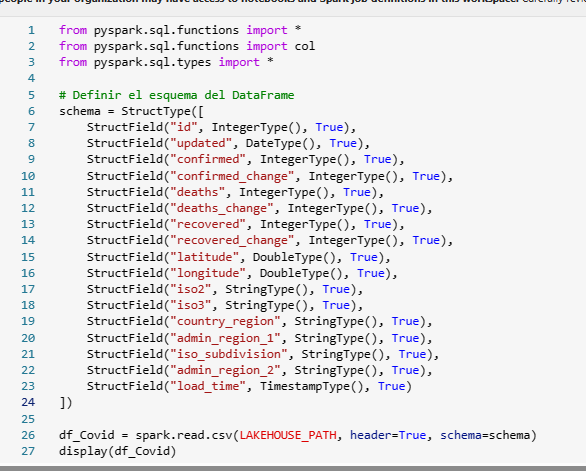

Quitamos columnas que no necesitamos.

~~~
#Quitamos las columnas que no necesitamos, queremos sólo el país y sus coordenadas
columns_to_drop = ['iso2','iso3','admin_region_1','iso_subdivision','admin_region_2']
df_Covid = df_Covid.drop(*columns_to_drop)
display(df_Covid)
~~~

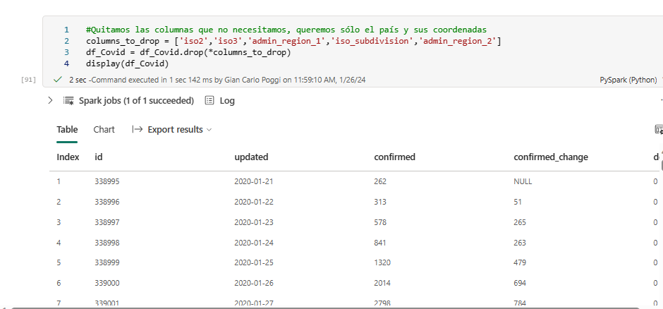

Verificamos nuestro esquema final.

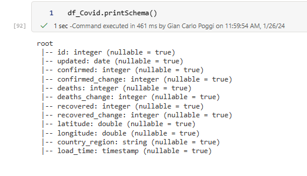

Finalmente, guardamos nuestro archivo en formato Parquet.

Ahora, si volvemos a nuestro Lakehouse, podemos verificar que nuestro archivo (inicialmente un CSV) fue transformado en un Parquet. Este proceso se puede hacer de manera automatica utilizando una actividad de Notebook en una pipeline. 

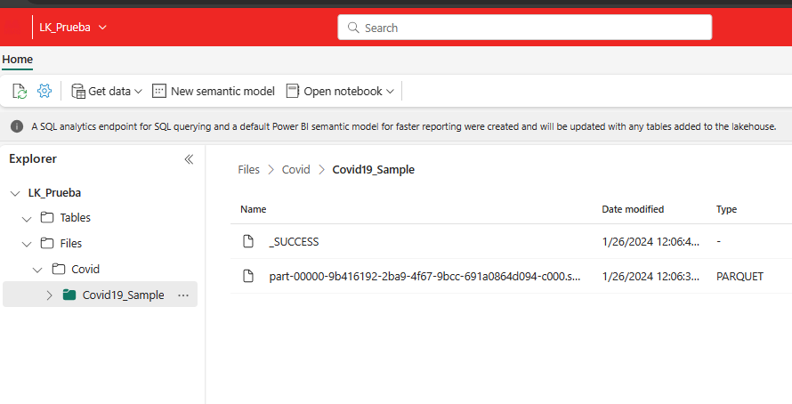

Volvemos nuevamente a la pipeline de Data Factory y agregamos una actividad de tipo "Notebook" llamada "Trabajar_CSV"

Y a esta misma actividad, le relacionamos el notebook trabajado en PySpark.

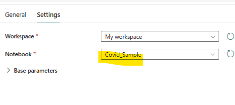

Finalmente, ejecutamos nuestra pipeline y veremos que se ejecuta correctamente el ETL.

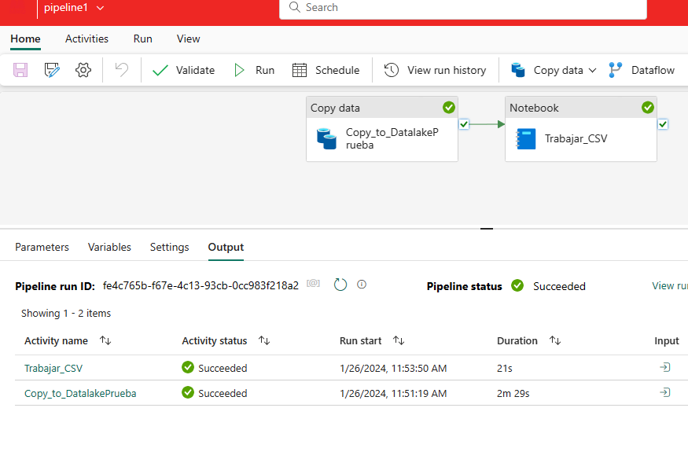

Ventajas de utilizar Fabric para este caso?

* Tenemos la integración de Data Factory y Data Lakehouse.
* No necesitamos utilizar Databricks para transformar nuestros archivos, se puede hacer todo el ETL desde Synapse Data Engineering.
* Se puede parametrizar el mismo proceso para ser reutilizado para otros proyectos.

----------------------------

# Bibliografía

https://azure.microsoft.com/es-es/products/synapse-analytics

https://learn.microsoft.com/en-us/fabric/data-engineering/lakehouse-overview

https://learn.microsoft.com/en-us/azure/databricks/getting-started/dataframes-python

https://blog.fabric.microsoft.com/en-us/blog/introducing-synapse-data-engineering-in-microsoft-fabric/

https://learn.microsoft.com/en-us/training/paths/get-started-fabric/

---

By **Facundo Montenegro**
